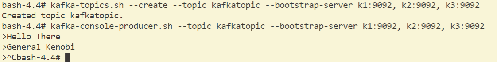
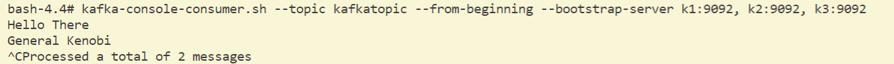
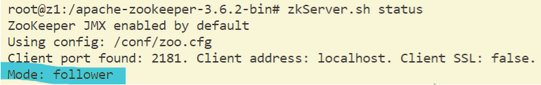
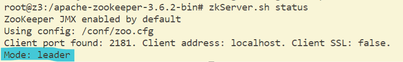
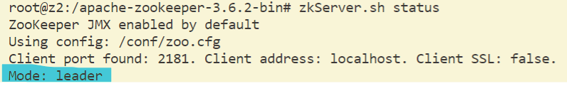

# CS3219-Task-D

## Set Up

Run: `docker-compose up -d`.

You can run `docker ps` to list the running images. 

There should be the images `k1`, `k2`, `k3`, `z1`, `z2`, `z3`.

## Pub-sub messaging

Connect to one of the kafka broker, in this case `k1`: `docker exec -it k1 /bin/bash`.

Create a topic, with a name, in this case `kafkatopic`: `kafka-topics.sh --create --topic kafkatopic --bootstrap-server k1:9092, k2:9092, k3:9092`.

Write to the topic with a the name `kafkatopic`: 
- Run `kafka-console-producer.sh --topic kafkatopic --bootstrap-server k1:9092, k2:9092, k3:9092`
- A prompt is opened where you can enter messages, where each line is a message. To stop writing messages, end with `Ctrl-C`.

Example:

Then, either `Ctrl-D` or open a new prompt window.

Connect to one of the other kafka broker. If the kafka broker that was connected earlier was `k1`, then connect to either `k2` or `k3`. In this case, `k2`: `docker exec -it k2 /bin/bash`.

Run `kafka-console-consumer.sh --topic kafkatopic --bootstrap-server k1:9092, k2:9092, k3:9092` to receive from topic.

End with `Ctrl-C`.

Example:

## Failover

Find the zookeeper leader.

This can be done with the following steps:
- Run `docker exec -it [$ZOOKEEPER_CONTAINER_NAME] /bin/bash` where `[$ZOOKEEPER_CONTAINER_NAME]` is either `z1`, `z2` or `z3`.
- Run `zkServer.sh status`
- The following response is given:
    - Ran on `z1`
        - 
    - Ran on `z3`
        - 
- From the highlighted section of the response, you can tell that `z3` is the leader.

Run `docker stop [$ZOOKEEPER_CONTAINER_NAME]` where in this case it is `z3`: `docker stop z3`.

Then find the zookeeper leader amongst `z2` and `z1`. In the following example, `z2` becomes the leader.

Example:

## Tear down

Run `docker-compose down`.
